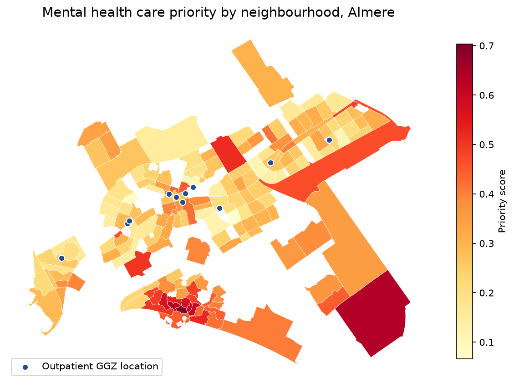

# Mental Health Care Access in Almere

Where in Almere is the need for mental health care highest, and how far do people there live from outpatient care? This project combines public health estimates, neighbourhood statistics and a hand-checked list of care providers to answer that question at neighbourhood (*buurt*) level.



## Why this project

Mental health problems in the Netherlands are rising, and waiting lists are long. Almere scores worse than the national average on loneliness, stress, anxiety/depression risk and financial strain (GGD Health Monitor 2022). Research on *distance decay* shows that people living further from outpatient care use it less. So where care is located affects who receives it.

**Research question:** Which neighbourhoods in Almere combine high mental health care needs with poor access to existing outpatient facilities, and where would a new facility add the most value?

## What the notebook does

1. **Loads public data:** RIVM health estimates and CBS key figures per neighbourhood, PDOK neighbourhood boundaries, and OpenStreetMap public transport stops.
2. **Builds a verified provider list:** OpenStreetMap found only 5 mental health locations in Almere, and missed major providers. I compiled the list by hand from ZorgkaartNederland, checked each location on the provider's own website, and geocoded the addresses with the PDOK Locatieserver (19/19 found; 11 adult outpatient, 5 youth, 3 excluded).
3. **Measures need:** five RIVM indicators for adults (2024): high risk of anxiety/depression, high stress, severe loneliness, difficulty making ends meet, and suicidal thoughts.
4. **Measures access:** the straight-line distance from each neighbourhood to the nearest adult outpatient location.
5. **Combines both** into a priority score (50% need, 50% access gap) and maps it, as a static map and an interactive Plotly map.

## Data sources

| Source | Used for |
|---|---|
| [RIVM – Gezondheid per wijk en buurt](https://dataderden.cbs.nl/) (table 50150NED) | Mental health indicators per neighbourhood |
| [CBS – Kerncijfers wijken en buurten 2024](https://opendata.cbs.nl/) (85984NED) | Population, households, income, welfare |
| [PDOK – Wijk- en buurtkaart 2024](https://www.pdok.nl/) | Neighbourhood boundaries |
| [PDOK Locatieserver](https://api.pdok.nl/bzk/locatieserver/search/v3_1/free) | Geocoding provider addresses |
| [OpenStreetMap / Overpass API](https://overpass-api.de/) | Public transport stops |
| [ZorgkaartNederland](https://www.zorgkaartnederland.nl/) | Verifying care providers (`data/ggz_manual.csv`) |

All data is public. Raw downloads are not in the repository because of their size. The notebook fetches them on the first run.

## Limitations

- The RIVM figures are **model estimates**, not measurements. They are useful for comparing neighbourhoods, not as exact values.
- Access is measured as **straight-line distance**, not travel time.
- The analysis ignores **capacity and waiting times**. A small practice counts the same as a large specialised centre.
- Care at GP practices (POH-GGZ) is not included.
- The score is **relative** to Almere, and the 50/50 weighting is a choice. A sensitivity analysis is in progress.

## Run it yourself

```bash
git clone <repo-url>
cd <repo-folder>
python -m venv .venv
# Windows: .venv\Scripts\activate   |   macOS/Linux: source .venv/bin/activate
pip install -r requirements.txt
```

1. Download the **Wijk- en buurtkaart 2024** GeoPackage from PDOK and save it as `data/wijkenbuurten_2024.gpkg`.
2. Open `Analysis.ipynb` and run all cells. The first run downloads the data into `data/`. Later runs use the local copies.

## Project structure

```
├── Analysis.ipynb          # full analysis
├── data/
│   └── ggz_manual.csv      # verified list of care providers (other data is downloaded)
├── output/                 # maps
├── requirements.txt
└── README.md
```

## Status

Done: data pipeline, need indicators, distance to care, priority score and maps.
Next: check the effect of sparsely populated neighbourhoods, a sensitivity analysis on the weights, public transport access, and conclusions.

## Author

Daniel Hoog, data analyst · [Optivue](https://optivueconsultancy.nl)